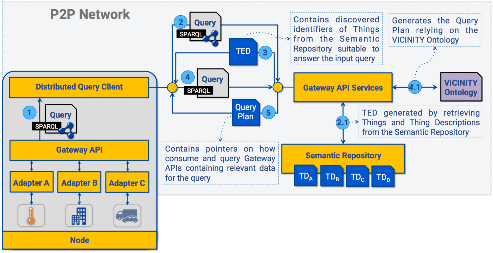
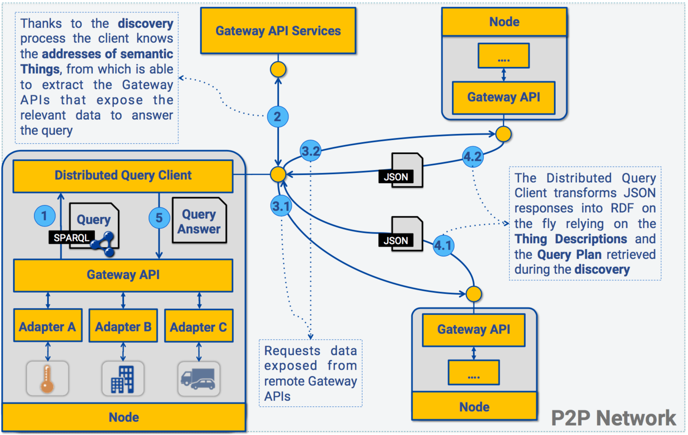

# Interoperability among the data endpoints

**Authors:**
* Andrea Cimmino
* Fernando Serena

In this section we introduce the approach followed in the VICINITY project to solve interoperability among data endpoints that expose data under a wide range of different formats.

The VICINITY platform aims at gathering IoT infrastructures, allowing them to expose their data so it can be accessed by other VICINITY components. Each IoT infrastructure that is registered in VICINITY is accessible through a component called Gateway API. Unfortunately, although the data that is exposed by all the Gateway APIs is in JSON format, each one of them relies on a different document structure. On the one hand, the VICINITY interoperability approach aims at enhancing such data with semantics following the VICINITY ontologies and enriching the consumable data available in the platform. For instance, instead of having JSON data with a number, semantics allows to refer to such data as the Celsius degrees registered by a thermometer that captures room temperature in a specific moment of time. On the other hand, since data from IoT infrastructures change over time, interoperability relies on transforming such data into semantic data on the fly. Relying on this approach, discovering relevant data to answer a specific query and answering such query with distributed real-time data becomes feasible.

Interoperability in VICINITY relies on several paramount concepts explained below:
* Gateway API: is a component of the P2P network that conforms VICINITY. The Gateway APIs expose JSON documents of IoT Infrastructures registered in VICINITY. It is paramount to remark that the JSON structures of the different Gateway APIs are in most of the cases different.
* Thing: A Thing refers to semantic data stored in the Semantic Repository referencing any physical object belonging to an IoT Infrastructure that was registered in VICINITY, and which data is exposed as a JSON document by a Gateway API. In other words, is an enhanced version of the JSON data that follows the semantic specifications described by the VICINITY ontologies. In general terms a Thing is static data, for instance it may specify that something is a thermometer. However Things do not contain dynamic data, such as the specific Celsius value registered in a moment of time by that thermometer. This dynamic data will be injected from the JSON of the corresponding Gateway API at querying time, transforming its JSON data into RDF; this process is known as virtualizing RDF.
* Thing Description: A Thing Description is always related to a Thing, it specifies how the JSON data exposed by a Gateway API should be virtualized into RDF data; which later will be injected to the semantic data of the Thing described by its Thing Description.
* Thing Ecosystem Description: also known as TED, contains the identifiers of the Things that may be relevant to answer a given query. However since VICINITY follows an ACL approach to access Gateway APIs, the TED points to the entire relevant Things regardless of their Gateway APIs fulfilling the ACL restrictions. The list of Gateway APIs accessible from a former one is known as neighbourhood.
* Virtual Thing Ecosystem Description: also known as VTED, is a modified version of a Thing Ecosystem Description. The Thing Ecosystem Descriptions do not take privacy policies into account (ACL), therefore a requester node that receives a Thing Ecosystem Description may peek, but not access, addresses of other Gateway APIs outside its neighbourhood. The Virtual Thing Ecosystem Description is a version of the former document that fulfils the privacy policies of the requester Gateway API containing only those Things related to Gateway APIs inside the requester neighbourhood.
* [RDF](https://www.w3.org/RDF/) and [SPARQL](https://www.w3.org/TR/rdf-sparql-query/): are W3C standards to represent data as graphs, the former allows to store semantic data in form of triples, the later is a language to query data stored in the RDF format.

To implement the interoperability functionality, VICINITY has two main components, the Gateway API Services and the Distributed Query Client.

* The Gateway API Services is a core component of the VICINITY platform and one of the two main pillars of the semantic interoperability approach followed in this project. The Gateway API Services is a web-based service that allows the different Gateway APIs to discover data of IoT infrastructures registered in VICINITY, and then, consume such data following privacy and secured communications protocols.
* The Distributed Query Client is a software module that is integrated in each Gateway API of VICINITY. This client is able to receive a query, discover relevant Things to answer such query by accessing to the related Gateway APIs of such Things, thus retrieving their JSON data, virtualizing it into RDF, and building a proper answer to the initial query. Notice that this process follows the privacy and security boundaries established in the communications of VICINITY

In the following subsections, we explain in detail how interoperability is carried out, the services provided by the Gateway API services and the functionality of the Distributed Query Client.

## Interoperability process

Interoperability among Gateway APIs in VICINITY has two phases: the former aims at discovering relevant Things and their related Gateway APIs; the latter aims at accessing these remote Gateway APIs and retrieving their data. Then, the data is translated into RDF and combined with the semantic data of the corresponding Thing. Finally, relying on a query plan, a set of query solutions is generated. In conclusion, each Gateway API is able to query the network of VICINITY with no prior knowledge of which Gateway API has relevant data to answer.

### Discovery

In the discovery phase a Gateway API provides its Distributed Query Client with a SPARQL query (1 from Figure 1). Then the Distributed Query Client forwards the query to the Gateway API Services in order to retrieve a Thing Ecosystem Description (TED) that contains the identifiers of relevant Things to answer the query (2 and 3 in Figure 1).  To do so, the Gateway API Services retrieves all the Things contained in the Semantic Repository and applies a discovery algorithm that keeps the identifiers of those things that potentially may answer the received query (2.1 in Figure 1). Then, the Distributed Query Client retrieves a suitable Query plan forwarding the query to the Gateway API Services (4 and 5 in Figure 1), the Gateway API Services generates the Query Plan relying on the VICINITY ontologies (4.1 in Figure 1). As a result, at the end of this process the Distributed Query Client counts with a Thing Ecosystem Description containing relevant Thing identifiers and a Query Plan that establishes which data is relevant to answer the query.

Figure 1.

### Distributed Access

Once the discovery is performed, the Distributed Query Client starts the distributed access phase. Firstly the Gateway API must provide its Distributed Query Client with a list of identifiers referencing those Gateway APIs to which it is allowed to access; such list is known as its neighborhood. The Distributed Query Client modifies the Thing Ecosystem Description in order to contain only the identifiers of the Things that refer to these Gateway APIs to which the requester Gateway API is allowed to; the new version of the TED is known as Virtual Thing Ecosystem Description (1 and 2 in Figure 2).

Using the VTED, the Distributed Query Client retrieves the http addresses of the Gateway APIs referenced in the Things contained in the VTED. Then, it accesses to each of these Gateway APIs retrieving the JSON data that they expose (3.1, 3.2, 4.1, and 4.2 in Figure 2). In addition, relying on the VTED, the Distributed Query Client retrieves from the Gateway API Services all the semantic data of the Things contained within and their Thing Descriptions; using the latter data it transforms each JSON document into RDF data that is included in the corresponding Thing RDF data. As a result, for each Thing in the VTED for which the Distributed Query Client retrieved the semantic data from the Gateway API Services, it uses the Thing Description related to each of these Things to transform JSON data into RDF (virtualized data), and finally combines the semantic data of a Thing with the virtualized data of the related Gateway API.

Finally, the Distributed Query Client uses the retrieved Query Plan to prune those Things which semantic data do not fit the plan. After this, a query solution is produced. As a result, the Distributed Query Client generates a set of query solutions for the input query (5 in Figure 2).

Figure 2.

## Gateway API Services Interface

The Gateway API Services is a core component of the VICINITY platform and one of the two main pillars of the semantic interoperability approach followed in this project. The Gateway API Services is a web-based service that allows the different Gateway APIs to discover data of IoT infrastructures registered in VICINITY and, then, to consume such data following privacy and secured communications protocols.

The functionalities that the Gateway API Services offers to implement VICINITY interoperability are:

| Interface | Input | Output |
| --- | --- | --- |
| /discovery | SPARQL Query | TED |
| /plan | SPARQL Query | Query plan |
| /resource | A list of Thing or Thing Description identifiers | Semantic Data of requested resources |

Whether a Gateway API receives a query expressed in SPARQL that refers to generic concepts such as sensors or thermometers (without referencing a specific Gateway API exposing such data) the Gateway API Services can be relied on to retrieve a TED referencing the Things related to the Gateway APIs that expose the suitable data required to answer the query. Once a Gateway API obtains the TED, it has to retrieve also a query plan that will specify how to virtualize the JSON responses of other Gateway APIs. Therefore the same query must be submitted to the Gateway API services in order to receive such plan. Next, we present a summary of the functionalities consumable through the interface of the Gateway API Services:

* Discovery: receives a SPARQL query and produces a Thing Ecosystem Description containing identifiers of wot:Things that are relevant to answer the query.
* Query Plans: receives a SPARQL query and produces a query plan that is an RDF document describing which specific data is suitable to answer the query.
* Semantic Resources: receives a resources identifier and returns its semantic RDF data.

## Distributed Query Client

The Distributed Query Client is a component of each Gateway API in VICINITY that aims at interacting with the Gateway API Services of behalf of the Gateway APIs. The Distributed Query Client is in charge of retrieving the Thing Ecosystem Description from the Gateway API Services, with which it generates a Virtual Thing Ecosystem Description. In addition, the Distributed Query Client is able to process the Query Plans produced by the Gateway API Services, access remote Gateway APIs retrieving JSON data, virtualize RDF from such JSON data, and produce a solution for a given query.

A Gateway API in order to a consume the Distributed Query Client functionalities has to provide a SPARQL, query and the list of remote Gateway APIs to which is allowed to access; in other words, its list of neighbors. Once these two elements are provided to the Distributed Query Client, the following steps are done in order to answer the query:

* Retrieve TED from Gateway API Services
* Generate VTED filtering the TED in base of neighbours provided by the Gateway API
* For each Thing in the VTED
    * Retrieve semantic data of current Thing, and its Thing Description, through the Gateway API Services
    * Extract from the Thing Description the address of the remote Gateway API related to the current Thing
    * Request data to such Gateway API and virtualize its response, i.e., translate the JSON data into semantic data. Then combine the semantic data of the Thing with the virtualized data.
    * Relaying on the query plan, prune those Things that are no relevant to answer the query
    * Generate a query solution using this Thing
* Return all the query solutions generated

Although is not specified in the previous steps, all communications to the Gateway API Services and the remote Gateway APIs are wired through the P2P network ensuring the privacy and security specified in the VICINITY platform.

