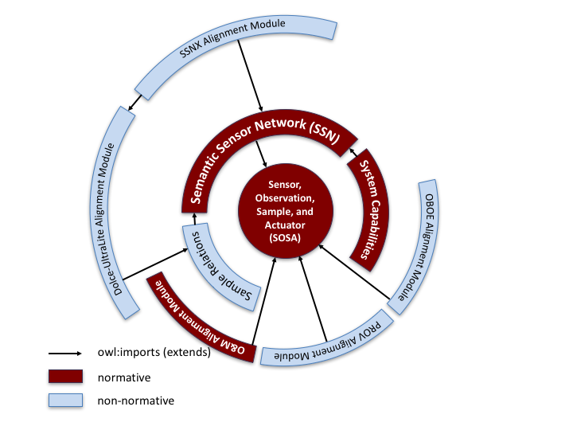
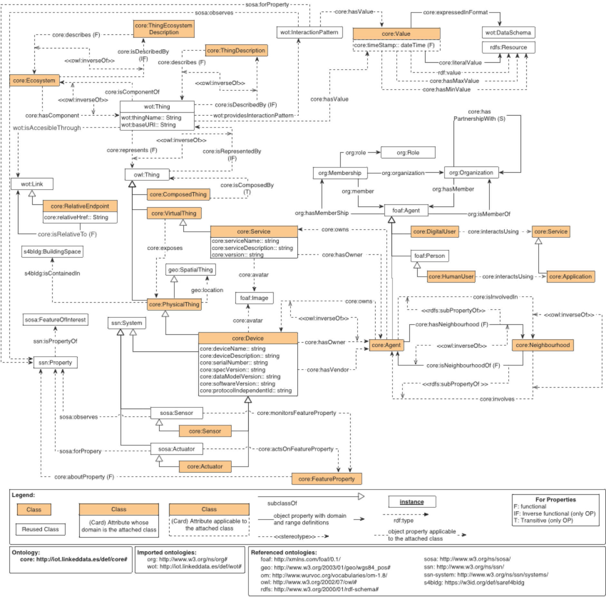
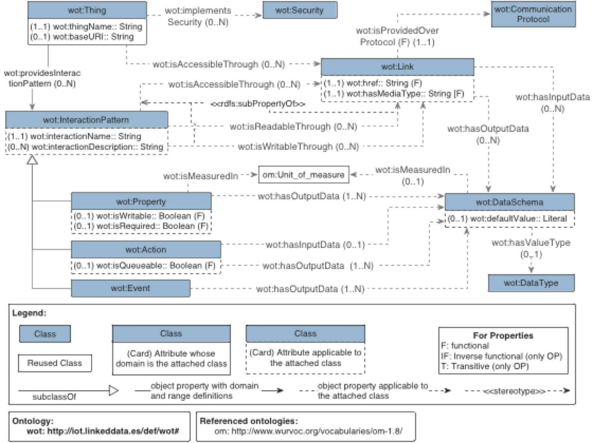

# Ontology network updates for VICINITY platform

**Authors:**
* Andrea Cimmino
* María Poveda Villalón
* Raúl García Castro
* Fernando Serena

This section describes the evolution of the [VICINITY ontology network](http://vicinity.iot.linkeddata.es/) according to the VICINITY platform needs (it is worth noting that other updates of the ontology network will be reported in the corresponding deliverables). As already described in “D2.2. Detailed Specification of the Semantic Model” [1], the VICINITY ontology network is designed following a modular approach. In such document, the general process being followed to develop the ontology network was also described.

The main update in the VICINITY ontology network is related to its modularization.  In the previous version of the network three modules were defined, namely:
* Core: http://iot.linkeddata.es/def/core/
* WoT: http://iot.linkeddata.es/def/wot/
* WoT mappings: http://iot.linkeddata.es/def/wot-mappings/

In the updated version of the ontology network, there is a total of five modules as shown in Figure 1. The two new modules are:
* Adapters: http://iot.linkeddata.es/def/adapters/
* Datatypes: http://iot.linkeddata.es/def/datatypes/

Figure 1. Updated VICINITY ontology network overview

It is worth noting that most of the content of the adapters module was previously defined in the core module of the network. That is, the adapters module has been created to decouple from the generic part of the ontology related to the VICINITY platform (i.e., the core module) the particular characteristics of those devices that come from specific pilot scenarios. In summary, while the datatypes module has been created from scratch for this release, the adapters module represents an extraction of part of the previous core module as documented in “D4.1. Set of open sample VICINITY gateway adapters”.
In the reminder of this section, both in the text and the figures, ontology elements are identified by its URI which is represented by a prefix and an identifier, for example wot:Thing, where “wot” is the prefix used for http://iot.linkeddata.es/def/wot/ and “Thing” is the identifier of the ontology element within the namespace “wot”. The list of prefixes, and corresponding ontologies, reused along the ontologies and that might appear in this document are listed following table.

| Prefix | Ontology namespace |
| --- | --- |
| foaf | http://xmlns.com/foaf/0.1/ |
| geo | http://www.w3.org/2003/01/geo/wgs84_pos# |
| org | http://www.w3.org/ns/org# |
| owl | http://www.w3.org/2002/07/owl# |
| rdf | http://www.w3.org/1999/02/22-rdf-syntax-ns# |
| rdfs | http://www.w3.org/2000/01/rdf-schema# |
| ssn | http://www.w3.org/ns/ssn/ |
| ssn-system | http://www.w3.org/ns/ssn/systems/ |
| sosa | http://www.w3.org/ns/sosa/ |
| s4bldg | https://w3id.org/def/saref4bldg |

Main changes in the current VICINITY ontology network are related to the adoption of the new SSN/SOSA ontology. In October 2018 the Spatial Data on the Web Working Group (SDWWG), a joint W3C-OGC project, published the new Semantic Sensor Network Ontology as official W3C recommendation [3]. In this new version several vertical and horizontal modules are provided including the lightweight core ontology SOSA (Sensor, Observation, Sample, and Actuator). The SSN module is built in this version on top of the SOSA ontology. These two modules among others are depicted in Figure 2. In the following, the changes made according to this update of the SSN ontology are summarized.
First of all, the namespace for the SSN ontology has been updated. More precisely, in the current version the following three SSN-related namespaces are used:

| Prefix | Ontology namespace |
| --- | --- |
| sosa | http://www.w3.org/ns/sosa/ |
| ssn | http://www.w3.org/ns/ssn/ |
| ssn-system | http://www.w3.org/ns/ssn/systems/ |

Figure 2. SOSA/SSN ontology architecture. Image taken from [3]

It should me mentioned that the prefix old-ssn will be used to refer to the previous SSN ontology namespace http://purl.oclc.org/NET/ssnx/ssn#.
In this sense, different type of changes had to be done mostly based on the previous namespace used in the VICINITY modules and the new SSN namespaces. These changes can be classified in the following types:

* Replace or adapt ontology elements defined in the core namespace by elements defined in the new sosa namespace. For example, the object property http://iot.linkeddata.es/def/core/monitors has been replaced by http://www.w3.org/ns/sosa/observes.
* Replace or adapt ontology elements defined in the old ssn by elements defined in the new ssn namespace. For example, the classes ssn:Property and ssn:System previously defined in the http://purl.oclc.org/NET/ssnx/ssn# namespace have been replaced by the homonym classes in the http://www.w3.org/ns/ssn/ namespace.
* Replace or adapt ontology elements defined in the old ssn by elements defined in the new sosa namespace. For example, the class ssn:FeatureOfInterest previously defined in the http://purl.oclc.org/NET/ssnx/ssn# namespace have been replaced by the homonym class in the http://www.w3.org/ns/sosa/ namespace.
* Replace or adapt ontology elements defined in the old ssn by elements defined in the new ssn-system namespace. For example, the class ssn:SystemProperty previously defined in the http://purl.oclc.org/NET/ssnx/ssn# namespace have been replaced by the homonym class in the http://www.w3.org/ns/ssn/systems/ namespace.

In addition, some ontology classes from the previous version of the ssn ontology are no longer supported in the new release, for example the classes old-ssn:Device and old-ssn:SensingDevice. For this reason, the subclassOf axioms previous defined between the core:Sensor class and the old-ssn:SensingDevice has been removed.

Another ontology elements have been included in the ontology as consequence of the platforms needs, as for the case of the object properties core:represents and its inverse core:isRepresentedBy. The core:represents property is used to link a Web of Thing representation of a given thing (wot:Thing) to a real world thing (owl:Thing)

In order to align the VICINITY ontology network with the ISO/IEC DIS 30118-1 (OCF) standard [4] some properties have been included for the classes core:Device, wot:Thing and wot:InteractionPattern. More precisely, for the class core:Device the datatype properties core:dataModelVersion, core:softwareVersion and core:protocolIndependentId have been included in the core module. For the wot:Thing concept, the property wot:primaryEndpoint has been included in the wot module. Finally, for the class wot:InteractionPattern the datatype properties wot:interationName and wot:interactionDescription have been added also in the WoT module.

Minor modifications to the ontology have been also carried out in order to support the sematic annotation of devices from a Web of Things point of view. In this sense, new local axioms have been added to the class wot:Link in order to connect instances of such class directly with instances of the wot:DataSchema class by means of the properties wot:hasInputData and wot:hasOutputData.

Finally, the core:Service concept is being refined according to the conversations and decisions being taken in the discussions about the value added services characterization. While some information is already included in the ontology, at the time of writing this document, it is still work in progress that will be reported in future updates of the ontology network.

In summary, the updated diagrams for the core and wot modules are provided in Figure 3 and Figure 4 respectively.

Figure 3. VICINITY core module conceptualization

Figure 4. VICINITY WoT module conceptualization

In the figures included to represent parts of the ontologies, the following graphical conventions are used.

Colored rectangles are used to denote classes created in the ontology being described while white rectangles denote reused classes. For all the entities, it is indicated in which ontology they are defined by the prefix included before their identifier.

Arrows are used represent properties between classes and to represent some rdf, rdfs and owl constructs, more precisely:

* Plain arrows with white triangles represent the rdfs:subClassOf relation between two classes. The origin of the arrow is the class to be declared as subclass of the class at the destination of the arrow.
* Plain arrows between two classes indicate that the object property has declared as domain the class in the origin and as range the class in the destination of the arrow. The identifier of the object property is indicated within the arrow.
* Dashed labelled arrows between two classes indicate that the object property can be instantiated between the classes in the origin and the destination of the arrow. The identifier of the object property is indicated within the arrow.
* Dashed arrows with identifiers between stereotype signs (i.e., “<< >>”) refer to OWL constructs that are applied to some ontology elements, that is, they can be applied to classes or properties depending on the OWL construct being used.
* Dashed arrows with no identifier are used to represent the rdf:type relation, indicating that the element in the origin of the arrow is an instance of the class in the destination of the arrow.

Datatype properties are denoted by rectangles attached to the classes, in an UML-oriented way. Dashed boxes represent datatype properties that can be applied to the class it is attached to while plain boxes represent that the domain of the datatype property is declared to be the class attached.

Individuals are denoted by rectangles in which the identifier is underlined.

Literals are denoted by rectangles in which the value is included between quotation marks.

The representation of additional property axioms (functional, inverse functional, transitive, and symmetric) that are being used in the diagram are shown in the overview ontology legends.

## References

[1] VICINITY project. D2.2 Detailed Specification of the Semantic Model. August 2017.

[2] Compton, M., Barnaghi, P., Bermudez, L., García-Castro, R., Corcho, O., Cox, S., Graybeal, J., Hauswirth, M., Henson, C., Herzog, A., Huang, V., Janowicz, J., Kelsey, W.D., Le Phouc, D., Lefort, L., Leggieri, M., Neuhaus, H., Nikolov, A., Page, K., Passant, A., Sheth, A., Taylor, K. (2012). The SSN ontology of the W3C semantic sensor network incubator group. Web semantics: science, services and agents on the World Wide Web, 17, 25-32.

[3] Haller, A., Janowicz, K., Cox, S., Le Phouc, D., Taylor, K., Lefrançois, M., Atkinson, r., García-Castro, R., Lieberman, J., Stadler, C. (July, 2017). Semantic Sensor Network Ontology. W3C Recommendation. 19 October 2017. https://www.w3.org/TR/vocab-ssn/

[4] (IoT) DIS 30118-1 - Text for ISO/IEC DIS 30118-1, Information technology — Open Connectivity Foundation — Part 1: Core specification